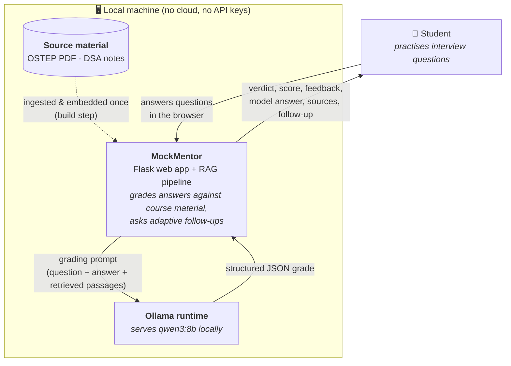
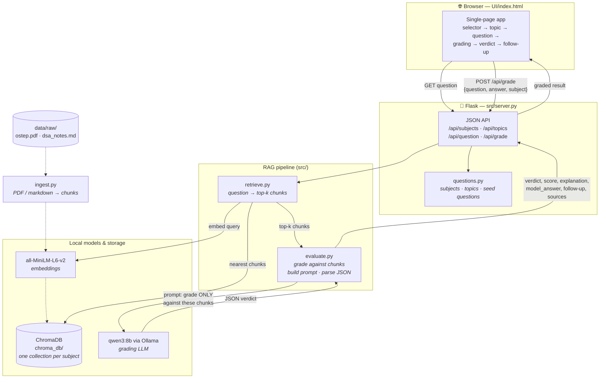

# MockMentor — Architecture

Two views: a **C4 Level 1 (System Context)** diagram showing MockMentor and the
things around it, and a **component / data-flow** diagram showing what happens
inside when a student submits an answer. Both are Mermaid, so they render
directly on GitHub.

---

## C4 Level 1 — System Context

Who and what MockMentor talks to. Everything runs on the student's own machine
(no cloud, no external APIs) — the only "external" pieces are the local Ollama
runtime and the source material on disk.

---

## Component / Data-flow — grading one answer

What runs inside MockMentor from "student hits Submit" to "verdict on screen".
The dashed path is the one-time **build** step (`embed_store.py`); the solid
path is the **request** flow at grade time.

---

## How to read it

- **The grade is grounded, not guessed.** `retrieve.py` finds the actual source
  passages first; `evaluate.py` tells the model to judge *only* against those.
  That retrieval-before-generation step is what makes this RAG (see
  [ADR-001](./adr/ADR-001-grounded-grading.md)).
- **Everything is local.** Embeddings (`all-MiniLM-L6-v2`), the vector store
  (ChromaDB on disk), and the LLM (`qwen3:8b` via Ollama) all run on the
  student's machine — no external calls (see
  [ADR-002](./adr/ADR-002-fully-local-stack.md)).
- **Build once, then serve.** Ingestion + embedding (dashed path) runs once via
  `python src/embed_store.py`. After that, each answer only walks the solid
  request path.
- **Multi-subject by config.** Each subject has its own ChromaDB collection;
  `ingest.py` slices a PDF by pages or markdown by `## ` headers into the same
  pipeline (see [ADR-004](./adr/ADR-004-os-first-dsa-extension.md)).
